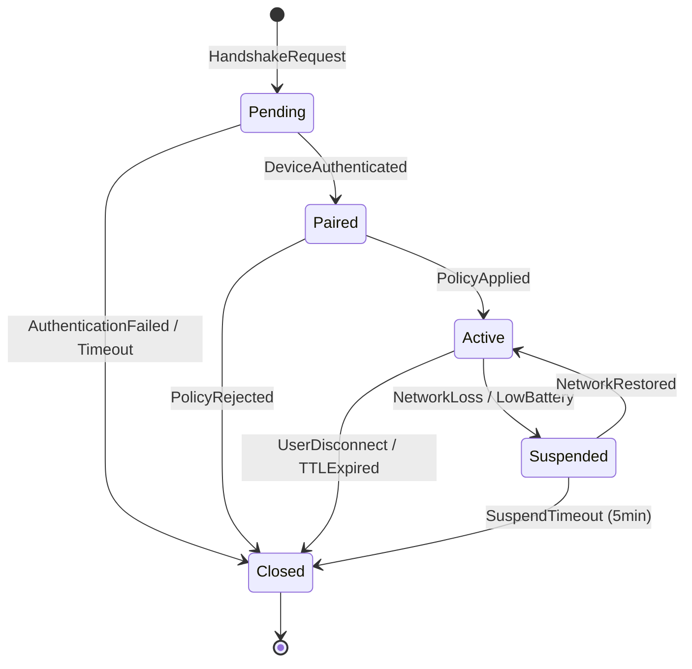

# Module Specification: Session Orchestrator

**Badges:** `🚫 No Implementation Code` `🚫 No C/C++ Dependencies`

> Implementation specification for Session Orchestrator module. Manages session establishment, state management, and version negotiation.

**Traceability ID**: `MOD-001-SESSION-ORCH`

---

## 1. Module Overview

- **Module Name:** Session Orchestrator
- **Responsible Team:** Protocol WG (ENG-PROTO-01, ENG-PROTO-02)
- **Overview:** Core module responsible for inter-device session establishment, handshake, state transition, version negotiation, and session persistence
- **Status:** Implementation in progress (P1 phase)
- **Repository Path:** `crates/session-orchestrator/`

### Value Proposition
- Centralized management of lifecycle from device pairing to session termination
- Clear state transitions and anomaly detection through 5-state state machine
- Duplicate request prevention with idempotency-key support
- Long session support with 12-hour TTL + 30-minute sliding renewal

---

## 2. Responsibilities and Boundaries

### Primary Responsibilities
- **Session Establishment**: Execute handshake protocol and issue session ID (UUIDv7)
- **State Management**: Control transitions among 5 states: Pending/Paired/Active/Suspended/Closed
- **Version Negotiation**: Coordinate protocol version between client/server (SemVer)
- **Persistence**: Save and restore session state to DB (distributed SQL compatible)
- **Audit**: Output session establishment, change, and termination events in OpenTelemetry format
- **Idempotency**: Detect duplicate requests via idempotent keys and provide appropriate responses

### Non-Responsibilities
- **Cryptographic Key Generation**: Delegated to Crypto & Trust Anchor module
- **QoS Policy Application**: Delegated to Policy & Profile Engine and QoS Scheduler
- **Data Stream Transfer**: Delegated to Transport Abstraction
- **UI Display**: Delegated to Experience Layer

### Related Documents
- [spec/architecture/overview.md](../architecture/overview.md) - System Architecture
- [spec/architecture/dependencies.md](../architecture/dependencies.md) - Module Dependencies
- [spec/requirements.md](../requirements.md) - Functional Requirements (FR-01, FR-02, FR-04)

---

## 3. Interface

### 3.1 Input

| Name | Protocol/Format | Validation Rules | Source |
|------|----------------|------------------|--------|
| **HandshakeRequest** | Async Request Queue (CBOR) | session_id: UUIDv7, client_public_key: 32bytes, protocol_version: SemVer | Control-Plane API |
| **StateTransitionRequest** | Internal Event Bus (JSON) | session_id: UUIDv7, target_state: Enum, idempotency_key: String(36) | Policy Engine, QoS Scheduler |
| **SessionQuery** | gRPC (Protobuf) | session_id: UUIDv7 OR device_id: String | Telemetry & Insights, Experience Layer |

**Detailed Validation Rules**:
- `session_id`: UUIDv7 format, monotonic increment verification
- `protocol_version`: `major.minor.patch` format, support range `1.0.0 ~ 2.9.99`
- `idempotency_key`: UUIDv4 or random string (36 chars), uniqueness guaranteed within 24 hours

### 3.2 Output

| Name | Protocol/Format | SLA | Destination |
|------|----------------|-----|-------------|
| **SessionEstablished** | Event Bus (JSON) | P95 < 500ms | Crypto & Trust, Policy Engine, Telemetry |
| **SessionStateChanged** | Event Bus (JSON) | P95 < 200ms | All subscribers |
| **SessionMetrics** | OTLP (Protobuf) | Real-time (1-second batch) | Telemetry & Insights |
| **AuditLog** | JSON Lines (append-only) | Synchronous write | Audit Storage (WORM) |

**Output Schema** (`SessionEstablished`):
```json
{
  "event_type": "session.established",
  "event_version": "1.0.0",
  "session_id": "01H9...",
  "device_a_id": "DEV-ABCD-1234",
  "device_b_id": "DEV-EFGH-5678",
  "negotiated_version": "1.2.3",
  "shared_key_id": "k_session_xyz",
  "ttl_seconds": 43200,
  "created_at": "2025-10-01T10:30:00Z",
  "trace_id": "4bf92f..."
}
```

Detailed Specification: [spec/architecture/interfaces.md](../architecture/interfaces.md)

---

## 4. Data Model

### 4.1 Primary Entities

#### Session
```yaml
Session:
  session_id: UUIDv7  # Primary Key
  device_a_id: String(64)
  device_b_id: String(64)
  state: Enum[Pending, Paired, Active, Suspended, Closed]
  protocol_version: SemVer
  shared_key_id: String(128)  # Reference to Crypto module
  created_at: Timestamp
  updated_at: Timestamp
  expires_at: Timestamp  # TTL enforcement
  last_activity_at: Timestamp  # For 30min sliding window
  idempotency_keys: Array<IdempotencyRecord>
```

#### IdempotencyRecord
```yaml
IdempotencyRecord:
  idempotency_key: String(36)  # Indexed
  request_hash: String(64)  # FNV-1a hash of request body
  response_snapshot: JSONB  # Cached response for duplicate requests
  created_at: Timestamp
  expires_at: Timestamp  # 24h retention
```

### 4.2 Persistence
- **Data Store**: CockroachDB (distributed SQL, Multi-region support)
- **Retention Period**: 
  - Active/Suspended sessions: Until TTL expiration
  - Closed sessions: 90 days (audit requirement)
  - IdempotencyRecord: 24 hours
- **Indexes**: 
  - Primary: `session_id`
  - Secondary: `(device_a_id, device_b_id)`, `state`, `expires_at`
  - Unique: `idempotency_key` (24h window)

### 4.3 Encryption/Confidentiality
- `shared_key_id` stores only reference ID to KMS, does not store actual key
- Session state itself treated as non-confidential data but access control via RBAC
- Details: [spec/security/encryption.md](../security/encryption.md)

---

## 5. Dependencies

| Type | Component | Interface | SLA/Contract | Notes |
|------|-----------|-----------|--------------|-------|
| **Upper** | Control-Plane API | REST/gRPC | P95 < 500ms | Session creation request source |
| **Upper** | Experience Layer | gRPC | P95 < 300ms | Session state queries |
| **Lower** | Crypto & Trust Anchor | Async Request Queue | P95 < 200ms | Key agreement and verification |
| **Lower** | Policy & Profile Engine | Event Bus | Best-effort | Policy application notifications |
| **Lower** | Telemetry & Insights | OTLP Stream | Fire-and-forget | Metrics transmission |
| **Peer** | CockroachDB | SQL/gRPC | P99 < 100ms (read), P99 < 250ms (write) | Session persistence |

**Dependency Rule Compliance**:
- Session Orchestrator prohibits direct dependency on Physical Adapter Layer (via Transport Abstraction)
- Event bus guarantees asynchronous and loose coupling (backpressure support)
- Details: [spec/architecture/dependencies.md](../architecture/dependencies.md)

---

## 6. Performance & Scalability

### 6.1 SLO/SLI

| Metric | Target | Measurement Method |
|--------|--------|-------------------|
| Session Establishment Latency (P95) | < 500ms | Handshake start → SessionEstablished event fired |
| Session Establishment Latency (P99) | < 800ms | Same as above |
| State Transition Latency (P95) | < 200ms | StateTransitionRequest received → change complete |
| Session Establishment Success Rate | ≥ 99.5% | Success count / total requests |
| Concurrent Sessions (single instance) | 10,000 | Memory usage < 2GB |
| Throughput | 500 req/sec (establishment) | Load test |

### 6.2 Capacity Planning
- **Horizontal Scale**: Automatic scaling via Kubernetes HPA (CPU 70% threshold)
- **Replica Count**: Minimum 3, maximum 20 (Multi-AZ deployment)
- **DB Connection Pool**: 50 connections/instance
- Details: [spec/performance/scalability.md](../performance/scalability.md)

### 6.3 Performance Testing
- **Baseline**: 100 req/sec, 1000 concurrent sessions
- **Burst Test**: 1000 req/sec for 30 seconds
- **Soak Test**: 200 req/sec for 24 hours
- Details: [spec/performance/benchmark.md](../performance/benchmark.md)

---

## 7. Security & Privacy

### 7.1 Authentication/Authorization
- **Authentication**: Requests via Control-Plane API use OAuth2 Client Credentials + mTLS
- **Authorization**: RBAC (Role: `session:create`, `session:read`, `session:update`, `session:delete`)
- Details: [spec/security/auth.md](../security/auth.md)

### 7.2 Threat Model Countermeasures

| Threat (STRIDE) | Countermeasure | Verification Method |
|----------------|----------------|---------------------|
| **Spoofing** | mTLS + device certificate verification | Unit test: Confirm fake certificate rejection |
| **Tampering** | Idempotency-key + Request hash | Integration test: Tampered request detection |
| **Repudiation** | Immutable audit log (WORM) | E2E test: Confirm log cannot be tampered |
| **Information Disclosure** | Store only shared_key_id | Security scan |
| **Denial of Service** | Rate limiting (100 req/sec/IP) | Load test |
| **Elevation of Privilege** | RBAC enforcement + least privilege principle | Penetration test |

Details: [spec/security/vulnerability.md](../security/vulnerability.md)

### 7.3 Data Classification
- **Public**: session_id, state, protocol_version
- **Confidential**: device_id (RBAC protected)
- **Secret**: shared_key_id (KMS reference only)

---

## 8. Observability

### 8.1 Metrics

| Metric Name | Type | Unit | Labels | Collection Reason |
|------------|------|------|--------|-------------------|
| `session_established_total` | Counter | count | version, device_type | Track session establishment count |
| `session_establishment_duration_seconds` | Histogram | seconds | version, result | Latency distribution |
| `session_state_transitions_total` | Counter | count | from_state, to_state | State transition pattern analysis |
| `session_active_count` | Gauge | count | - | Current active session count |
| `session_errors_total` | Counter | count | error_type | Error classification |

### 8.2 Logs

**Format**: OpenTelemetry JSON Lines
```json
{
  "timestamp": "2025-10-01T10:30:00.123Z",
  "level": "INFO",
  "logger": "session_orchestrator",
  "trace_id": "4bf92f...",
  "span_id": "7d8f5a...",
  "event": "session.established",
  "session_id": "01H9...",
  "device_a_id": "DEV-***",
  "device_b_id": "DEV-***",
  "protocol_version": "1.2.3"
}
```

**Retention Period**: 30 days (hot storage) + 90 days (cold storage)

### 8.3 Tracing
- **Sampling**: Always 20%, 100% on error
- **Span Naming**: `session_orchestrator.<operation>` (e.g., `session_orchestrator.establish`)
- **Context Propagation**: W3C Trace Context

Reference: [spec/testing/metrics.md](../testing/metrics.md)

---

## 9. State Machine Specification

### 9.1 State Definition



### 9.2 State Transition Table

| Current State | Event | Next State | Precondition | Side Effect |
|--------------|-------|------------|--------------|-------------|
| **Pending** | `DeviceAuthenticated` | Paired | Crypto & Trust verification success | Fire SessionEstablished event |
| **Pending** | `AuthenticationFailed` | Closed | Verification failure or 30-second timeout | Record error log |
| **Paired** | `PolicyApplied` | Active | Policy Engine approval | Notify QoS Scheduler |
| **Paired** | `PolicyRejected` | Closed | Policy non-compliance | Error notification |
| **Active** | `NetworkLoss` | Suspended | 3-second continuous communication loss | Start timer (5 minutes) |
| **Active** | `UserDisconnect` | Closed | Explicit app disconnection | Release resources |
| **Active** | `TTLExpired` | Closed | 12 hours elapsed | Automatic cleanup |
| **Suspended** | `NetworkRestored` | Active | Communication recovery detection | Restore state |
| **Suspended** | `SuspendTimeout` | Closed | 5 minutes elapsed | Discard session |

### 9.3 Invalid Transition Detection
- Disallowed transitions (e.g., Closed → Active) immediately rejected as `ERR_STATE_INVALID` error
- On transition failure, maintain current state and record in audit log

---

## 10. Requirements Traceability

### FR-01: Beacon Detection and List Display
- **Related**: Session Orchestrator receives device detection results and manages as session candidates
- **Implementation**: Validate device_id upon `HandshakeRequest` reception

### FR-02: Multi-Factor Pairing Including OOB
- **Related**: Integrate OOB authentication through coordination with Crypto & Trust module in handshake protocol
- **Implementation**: Delegate OOB token verification to Crypto in `Pending → Paired` transition

### FR-04: QoS Adjustment
- **Related**: Distribute events to Policy Engine upon session state change
- **Implementation**: Receive QoS policy update events in `Active` state and maintain state

**Traceability ID Mapping**:
```
MOD-001-SESSION-ORCH → FR-01 (device pairing)
MOD-001-SESSION-ORCH → FR-02 (authentication)
MOD-001-SESSION-ORCH → FR-04 (policy coordination)
```

---

## 11. Test Strategy

### 11.1 Unit Tests

| Test Case | Target | Success Criteria | Reference |
|-----------|--------|------------------|-----------|
| State machine transitions (normal) | All 9 transitions | 100% coverage | [spec/testing/unit-tests.md](../testing/unit-tests.md) |
| State machine transitions (abnormal) | Invalid transition detection | ERR_STATE_INVALID occurrence | Same |
| Idempotency-key verification | Duplicate request processing | Return cached response | Same |
| TTL management | Timeout processing | Automatic transition to Closed state | Same |
| Protocol version negotiation | SemVer compatibility judgment | Select compatible version | Same |

**Coverage Target**: Instruction coverage ≥90%, branch coverage ≥85%

### 11.2 Integration Tests

| Scenario | Integration Target | Success Criteria | Reference |
|----------|-------------------|------------------|-----------|
| End-to-end pairing | Crypto, Policy, QoS | Session establishment P95 < 500ms | [spec/testing/integration-tests.md](../testing/integration-tests.md) |
| Failure recovery | CockroachDB failover | State restoration success rate > 99% | Same |
| Massive simultaneous session establishment | All modules | 10,000 sessions/30 seconds | Same |

### 11.3 E2E Tests

| Journey | Scenario | Verification Items | Reference |
|---------|----------|-------------------|-----------|
| Device Onboarding | New device pairing | UI → API → Session establishment | [spec/testing/e2e-tests.md](../testing/e2e-tests.md) |
| Long-duration Session | 12-hour connection maintenance | Sliding window update operation | Same |

### 11.4 Security Tests
- **SAST**: Static analysis via `cargo clippy`, `cargo-audit`
- **Penetration Test**: Attempt session establishment with forged certificates (confirm failure)
- Reference: [spec/security/vulnerability.md](../security/vulnerability.md)

---

## 12. Deployment & Operations

### 12.1 Deployment Method
- **Package Format**: Docker image (multi-arch: amd64, arm64)
- **CI/CD**: GitHub Actions → Staging → Manual Approval → Production
- **Deployment Strategy**: Blue/Green deployment (5-minute warmup period)
- Details: [spec/deployment/ci-cd.md](../deployment/ci-cd.md)

### 12.2 Infrastructure Requirements
- **CPU**: 2 vCPU/instance (burstable)
- **Memory**: 2GB/instance
- **Network**: 1Gbps (internal mesh communication)
- **Storage**: Stateless (DB dependency only)
- Details: [spec/deployment/infrastructure.md](../deployment/infrastructure.md)

### 12.3 Rollback
- **Trigger Condition**: Session establishment success rate < 95% (sustained for 5 minutes)
- **Procedure**: Blue/Green rollback (within 3 minutes)
- **Data Consistency**: No impact as session state managed in DB
- Details: [spec/deployment/rollback.md](../deployment/rollback.md)

### 12.4 Operations Procedures
- **Health Check**: `GET /health` (200 OK if DB reachable)
- **Readiness**: `GET /ready` (200 OK if event bus connected)
- **Graceful Shutdown**: Upon SIGTERM reception, reject new requests → wait for existing sessions to complete (max 30 seconds) → terminate

---

## 13. Risks & Technical Debt

### 13.1 Known Risks

| Risk | Impact | Probability | Mitigation |
|------|--------|------------|------------|
| Session loss on DB failure | High | Low | Multi-region replication + automatic failover |
| Policy application delay due to event bus latency | Medium | Medium | Timeout monitoring + fallback settings |
| UUIDv7 collision | Low | Very Low | Collision detection + regeneration logic |

### 13.2 Technical Debt
- **Idempotency-key Memory Cache**: Currently DB only. Can improve performance with Redis integration (Priority: P2)
- **Protocol Version Auto-Migration**: Manual setting only. Add automatic recommendation feature (Priority: P3)

---

## 14. Acceptance Criteria (DoD)

- [x] Responsibilities and boundaries clearly defined
- [x] Input/output interfaces and data models detailed
- [x] 5-state state machine diagram and transition table complete
- [x] Linkage with FR-01/FR-02/FR-04 specified
- [x] Traceability ID (`MOD-001-SESSION-ORCH`) assigned
- [x] Performance, security, testing, and deployment criteria linked
- [x] Policy to exclude C/C++ dependencies reflected (Rust pure implementation)
- [x] Risks and improvement plans organized
- [x] Complies with dependency rules in `spec/architecture/dependencies.md`

---

## 15. Change History

| Version | Date | Changes | Approver |
|---------|------|---------|----------|
| 1.0 | 2025-10-01 | Initial version | Protocol WG (ENG-PROTO-01) |

---

**Related Documents**:
- [spec/templates/module-template.md](../templates/module-template.md) - Template
- [spec/architecture/overview.md](../architecture/overview.md) - Overall system view
- [spec/requirements.md](../requirements.md) - Functional requirements
- [spec/architecture/interfaces.md](../architecture/interfaces.md) - I/F details
- [spec/security/encryption.md](../security/encryption.md) - Encryption specification
