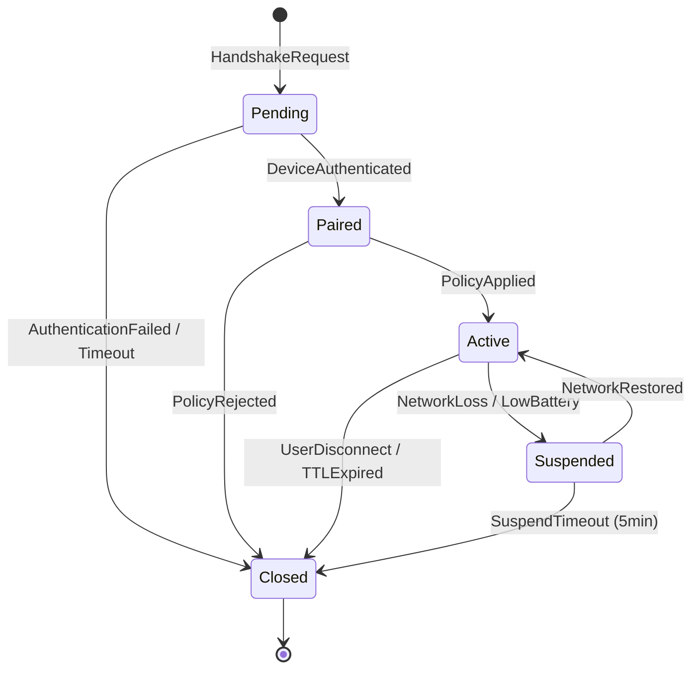

# Module Specification: Session Orchestrator

**バッジ:** `🚫 実装コード非出力` `🚫 C/C++依存禁止`

> Session Orchestrator モジュールの実装仕様書。セッション確立、状態管理、バージョンネゴシエーションを統括します。

**トレーサビリティ ID**: `MOD-001-SESSION-ORCH`

---

## 1. モジュール概要

- **モジュール名:** Session Orchestrator
- **担当チーム:** Protocol WG (ENG-PROTO-01, ENG-PROTO-02)
- **概要:** デバイス間のセッション確立、ハンドシェイク、状態遷移、バージョンネゴシエーション、セッション永続化を担当する中核モジュール
- **ステータス:** 実装中 (P1フェーズ)
- **リポジトリパス:** `crates/session-orchestrator/`

### 価値提案
- デバイスペアリングからセッション終了までのライフサイクルを一元管理
- 5状態ステートマシンによる明確な状態遷移と異常検知
- idempotency-key サポートによる重複リクエスト防止
- 12時間TTL + 30分滑走更新による長時間セッション対応

---

## 2. 責務と境界

### 主な責務
- **セッション確立**: ハンドシェイクプロトコルの実行とセッションID (UUIDv7) の発行
- **状態管理**: Pending/Paired/Active/Suspended/Closed の5状態間の遷移制御
- **バージョンネゴシエーション**: クライアント/サーバー間のプロトコルバージョン調整 (SemVer)
- **永続化**: セッション状態のDB保存と復元 (分散SQL対応)
- **監査**: セッション確立・変更・終了イベントのOpenTelemetry形式ログ出力
- **Idempotency**: 冪等キーによる重複リクエストの検出と適切な応答

### 非責務
- **暗号鍵の生成**: Crypto & Trust Anchor モジュールに委譲
- **QoSポリシー適用**: Policy & Profile Engine と QoS Scheduler に委譲
- **データストリーム転送**: Transport Abstraction に委譲
- **UI表示**: Experience Layer に委譲

### 関連ドキュメント
- [spec/architecture/overview.md](../architecture/overview.md) - システムアーキテクチャ
- [spec/architecture/dependencies.md](../architecture/dependencies.md) - モジュール依存関係
- [spec/requirements.md](../requirements.md) - 機能要件 (FR-01, FR-02, FR-04)

---

## 3. インターフェース

### 3.1 入力

| 名称 | プロトコル/フォーマット | 検証ルール | ソース |
|------|-------------------------|------------|--------|
| **HandshakeRequest** | Async Request Queue (CBOR) | session_id: UUIDv7, client_public_key: 32bytes, protocol_version: SemVer | Control-Plane API |
| **StateTransitionRequest** | Internal Event Bus (JSON) | session_id: UUIDv7, target_state: Enum, idempotency_key: String(36) | Policy Engine, QoS Scheduler |
| **SessionQuery** | gRPC (Protobuf) | session_id: UUIDv7 OR device_id: String | Telemetry & Insights, Experience Layer |

**検証ルール詳細**:
- `session_id`: UUIDv7形式、モノトニック増加性検証
- `protocol_version`: `major.minor.patch` 形式、サポート範囲 `1.0.0 ~ 2.9.99`
- `idempotency_key`: UUIDv4またはランダム文字列(36文字)、24時間内で一意性保証

### 3.2 出力

| 名称 | プロトコル/フォーマット | SLA | 宛先 |
|------|-------------------------|-----|------|
| **SessionEstablished** | Event Bus (JSON) | P95 < 500ms | Crypto & Trust, Policy Engine, Telemetry |
| **SessionStateChanged** | Event Bus (JSON) | P95 < 200ms | All subscribers |
| **SessionMetrics** | OTLP (Protobuf) | リアルタイム (1秒バッチ) | Telemetry & Insights |
| **AuditLog** | JSON Lines (append-only) | 同期書き込み | Audit Storage (WORM) |

**出力スキーマ** (`SessionEstablished`):
```json
{
  "event_type": "session.established",
  "event_version": "1.0.0",
  "session_id": "01H9...",
  "device_a_id": "DEV-ABCD-1234",
  "device_b_id": "DEV-EFGH-5678",
  "negotiated_version": "1.2.3",
  "shared_key_id": "k_session_xyz",
  "ttl_seconds": 43200,
  "created_at": "2025-10-01T10:30:00Z",
  "trace_id": "4bf92f..."
}
```

詳細仕様: [spec/architecture/interfaces.md](../architecture/interfaces.md)

---

## 4. データモデル

### 4.1 主要エンティティ

#### Session (セッション)
```yaml
Session:
  session_id: UUIDv7  # Primary Key
  device_a_id: String(64)
  device_b_id: String(64)
  state: Enum[Pending, Paired, Active, Suspended, Closed]
  protocol_version: SemVer
  shared_key_id: String(128)  # Reference to Crypto module
  created_at: Timestamp
  updated_at: Timestamp
  expires_at: Timestamp  # TTL enforcement
  last_activity_at: Timestamp  # For 30min sliding window
  idempotency_keys: Array<IdempotencyRecord>
```

#### IdempotencyRecord (冪等性レコード)
```yaml
IdempotencyRecord:
  idempotency_key: String(36)  # Indexed
  request_hash: String(64)  # FNV-1a hash of request body
  response_snapshot: JSONB  # Cached response for duplicate requests
  created_at: Timestamp
  expires_at: Timestamp  # 24h retention
```

### 4.2 永続化
- **データストア**: CockroachDB (分散SQL、Multi-region対応)
- **保持期間**: 
  - Active/Suspended セッション: TTL満了まで
  - Closed セッション: 90日間 (監査要件)
  - IdempotencyRecord: 24時間
- **インデックス**: 
  - Primary: `session_id`
  - Secondary: `(device_a_id, device_b_id)`, `state`, `expires_at`
  - Unique: `idempotency_key` (24h window)

### 4.3 暗号/秘匿
- `shared_key_id` はKMSへの参照IDのみを保存、実鍵は保存しない
- セッション状態自体は非機密データとして扱うが、アクセス制御はRBACで実施
- 詳細: [spec/security/encryption.md](../security/encryption.md)

---

## 5. 依存関係

| 種別 | コンポーネント | インターフェース | SLA/契約 | 備考 |
|------|----------------|-------------------|----------|------|
| **上位** | Control-Plane API | REST/gRPC | P95 < 500ms | セッション作成リクエスト元 |
| **上位** | Experience Layer | gRPC | P95 < 300ms | セッション状態クエリ |
| **下位** | Crypto & Trust Anchor | Async Request Queue | P95 < 200ms | 鍵合意・検証 |
| **下位** | Policy & Profile Engine | Event Bus | Best-effort | ポリシー適用通知 |
| **下位** | Telemetry & Insights | OTLP Stream | Fire-and-forget | メトリクス送信 |
| **Peer** | CockroachDB | SQL/gRPC | P99 < 100ms (read), P99 < 250ms (write) | セッション永続化 |

**依存ルール遵守**:
- Session Orchestrator は Physical Adapter Layer への直接依存を禁止 (Transport Abstraction 経由)
- イベントバスは非同期・疎結合を保証 (backpressure 対応)
- 詳細: [spec/architecture/dependencies.md](../architecture/dependencies.md)

---

## 6. 性能・スケーラビリティ

### 6.1 SLO/SLI

| 指標 | 目標値 | 測定方法 |
|------|--------|----------|
| セッション確立レイテンシ (P95) | < 500ms | ハンドシェイク開始→SessionEstablished イベント発火 |
| セッション確立レイテンシ (P99) | < 800ms | 同上 |
| 状態遷移レイテンシ (P95) | < 200ms | StateTransitionRequest 受信→変更完了 |
| セッション確立成功率 | ≥ 99.5% | 成功数 / 総リクエスト数 |
| 同時セッション数 (単一インスタンス) | 10,000 | メモリ使用量 < 2GB |
| スループット | 500 req/sec (確立) | ロードテスト |

### 6.2 キャパシティ計画
- **水平スケール**: Kubernetes HPA による自動スケール (CPU 70% threshold)
- **レプリカ数**: 最小3、最大20 (Multi-AZ配置)
- **DB接続プール**: 50 connections/instance
- 詳細: [spec/performance/scalability.md](../performance/scalability.md)

### 6.3 性能テスト
- **ベースライン**: 100 req/sec、1000同時セッション
- **バーストテスト**: 1000 req/sec for 30 seconds
- **ソークテスト**: 200 req/sec for 24 hours
- 詳細: [spec/performance/benchmark.md](../performance/benchmark.md)

---

## 7. セキュリティ & プライバシー

### 7.1 認証/認可
- **認証**: Control-Plane API 経由のリクエストは OAuth2 Client Credentials + mTLS
- **認可**: RBAC (Role: `session:create`, `session:read`, `session:update`, `session:delete`)
- 詳細: [spec/security/auth.md](../security/auth.md)

### 7.2 脅威モデル対策

| 脅威 (STRIDE) | 対策 | 検証方法 |
|--------------|------|----------|
| **Spoofing** | mTLS + デバイス証明書検証 | 単体テスト: 偽証明書拒否確認 |
| **Tampering** | Idempotency-key + Request hash | 統合テスト: 改ざんリクエスト検出 |
| **Repudiation** | 不可変監査ログ (WORM) | E2Eテスト: ログ改ざん不可確認 |
| **Information Disclosure** | shared_key_id のみ保存 | セキュリティスキャン |
| **Denial of Service** | Rate limiting (100 req/sec/IP) | 負荷テスト |
| **Elevation of Privilege** | RBAC強制 + 最小権限原則 | 侵入テスト |

詳細: [spec/security/vulnerability.md](../security/vulnerability.md)

### 7.3 データ分類
- **Public**: session_id, state, protocol_version
- **Confidential**: device_id (RBAC保護)
- **Secret**: shared_key_id (KMS参照のみ)

---

## 8. 観測性

### 8.1 メトリクス

| メトリクス名 | 型 | 単位 | ラベル | 収集理由 |
|-------------|---|------|--------|----------|
| `session_established_total` | Counter | count | version, device_type | セッション確立数追跡 |
| `session_establishment_duration_seconds` | Histogram | seconds | version, result | レイテンシ分布 |
| `session_state_transitions_total` | Counter | count | from_state, to_state | 状態遷移パターン分析 |
| `session_active_count` | Gauge | count | - | 現在のアクティブセッション数 |
| `session_errors_total` | Counter | count | error_type | エラー分類 |

### 8.2 ログ

**フォーマット**: OpenTelemetry JSON Lines
```json
{
  "timestamp": "2025-10-01T10:30:00.123Z",
  "level": "INFO",
  "logger": "session_orchestrator",
  "trace_id": "4bf92f...",
  "span_id": "7d8f5a...",
  "event": "session.established",
  "session_id": "01H9...",
  "device_a_id": "DEV-***",
  "device_b_id": "DEV-***",
  "protocol_version": "1.2.3"
}
```

**保持期間**: 30日 (hot storage) + 90日 (cold storage)

### 8.3 トレース
- **サンプリング**: 常時20%、エラー時100%
- **スパン命名**: `session_orchestrator.<operation>` (例: `session_orchestrator.establish`)
- **コンテキスト伝播**: W3C Trace Context

参照: [spec/testing/metrics.md](../testing/metrics.md)

---

## 9. ステートマシン仕様

### 9.1 状態定義



### 9.2 状態遷移表

| 現在状態 | イベント | 次状態 | 前提条件 | 副作用 |
|---------|---------|--------|---------|--------|
| **Pending** | `DeviceAuthenticated` | Paired | Crypto & Trust 検証成功 | SessionEstablished イベント発火 |
| **Pending** | `AuthenticationFailed` | Closed | 検証失敗 or 30秒タイムアウト | エラーログ記録 |
| **Paired** | `PolicyApplied` | Active | Policy Engine承認 | QoS Scheduler通知 |
| **Paired** | `PolicyRejected` | Closed | ポリシー不適合 | エラー通知 |
| **Active** | `NetworkLoss` | Suspended | 連続3秒通信断 | タイマー開始 (5分) |
| **Active** | `UserDisconnect` | Closed | アプリ明示的切断 | リソース開放 |
| **Active** | `TTLExpired` | Closed | 12時間経過 | 自動クリーンアップ |
| **Suspended** | `NetworkRestored` | Active | 通信復旧検知 | 状態復元 |
| **Suspended** | `SuspendTimeout` | Closed | 5分経過 | セッション破棄 |

### 9.3 不正遷移検出
- 許可されていない遷移 (例: Closed → Active) は `ERR_STATE_INVALID` エラーとして即座に拒否
- 遷移失敗時は現在状態を維持し、監査ログに記録

---

## 10. 要件トレーサビリティ

### FR-01: ビーコン検出と一覧提示
- **関連**: Session Orchestrator はデバイス検出結果を受け取り、セッション候補として管理
- **実装**: `HandshakeRequest` 受信時に device_id を検証

### FR-02: OOBを含む多要素ペアリング
- **関連**: ハンドシェイクプロトコルで Crypto & Trust モジュールと連携し、OOB認証を統合
- **実装**: `Pending → Paired` 遷移で OOB トークン検証を Crypto に委譲

### FR-04: QoS調整
- **関連**: セッション状態変更時に Policy Engine へイベント配信
- **実装**: `Active` 状態で QoS ポリシー更新イベントを受信し、状態を維持

**トレーサビリティID対応表**:
```
MOD-001-SESSION-ORCH → FR-01 (device pairing)
MOD-001-SESSION-ORCH → FR-02 (authentication)
MOD-001-SESSION-ORCH → FR-04 (policy coordination)
```

---

## 11. テスト戦略

### 11.1 単体テスト

| テストケース | 対象 | 成功基準 | 参照 |
|-------------|------|----------|------|
| ステートマシン遷移 (正常系) | 全9遷移 | 100%カバレッジ | [spec/testing/unit-tests.md](../testing/unit-tests.md) |
| ステートマシン遷移 (異常系) | 不正遷移検出 | ERR_STATE_INVALID 発生 | 同上 |
| Idempotency-key 検証 | 重複リクエスト処理 | キャッシュ応答返却 | 同上 |
| TTL 管理 | タイムアウト処理 | Closed 状態へ自動遷移 | 同上 |
| プロトコルバージョンネゴシエーション | SemVer互換性判定 | 互換バージョン選択 | 同上 |

**カバレッジ目標**: 命令カバレッジ 90%以上、分岐カバレッジ 85%以上

### 11.2 統合テスト

| シナリオ | 統合対象 | 成功基準 | 参照 |
|---------|----------|---------|------|
| エンドツーエンドペアリング | Crypto, Policy, QoS | セッション確立 P95 < 500ms | [spec/testing/integration-tests.md](../testing/integration-tests.md) |
| 障害復旧 | CockroachDB failover | 状態復元成功率 > 99% | 同上 |
| 大量セッション同時確立 | 全モジュール | 10,000セッション/30秒 | 同上 |

### 11.3 E2E テスト

| ジャーニー | シナリオ | 検証項目 | 参照 |
|-----------|---------|---------|------|
| デバイス導入 | 新デバイスペアリング | UI → API → Session確立 | [spec/testing/e2e-tests.md](../testing/e2e-tests.md) |
| 長時間セッション | 12時間接続維持 | 滑走ウィンドウ更新動作 | 同上 |

### 11.4 セキュリティテスト
- **SAST**: `cargo clippy`, `cargo-audit` による静的解析
- **侵入テスト**: 偽装証明書によるセッション確立試行 (失敗確認)
- 参照: [spec/security/vulnerability.md](../security/vulnerability.md)

---

## 12. デプロイ & 運用

### 12.1 デプロイ方法
- **パッケージ形式**: Docker image (multi-arch: amd64, arm64)
- **CI/CD**: GitHub Actions → Staging → Manual Approval → Production
- **デプロイ戦略**: Blue/Green deployment (5分 warmup期間)
- 詳細: [spec/deployment/ci-cd.md](../deployment/ci-cd.md)

### 12.2 インフラ要件
- **CPU**: 2 vCPU/instance (burst可能)
- **メモリ**: 2GB/instance
- **ネットワーク**: 1Gbps (内部mesh通信)
- **ストレージ**: Stateless (DBのみ依存)
- 詳細: [spec/deployment/infrastructure.md](../deployment/infrastructure.md)

### 12.3 ロールバック
- **トリガー条件**: セッション確立成功率 < 95% (5分継続)
- **手順**: Blue/Green 切り戻し (3分以内)
- **データ整合性**: セッション状態はDBで管理のため影響なし
- 詳細: [spec/deployment/rollback.md](../deployment/rollback.md)

### 12.4 運用手順
- **ヘルスチェック**: `GET /health` (200 OK if DB reachable)
- **Readiness**: `GET /ready` (200 OK if event bus connected)
- **Graceful Shutdown**: SIGTERM受信後、新規リクエスト拒否 → 既存セッション完了待機 (最大30秒) → 終了

---

## 13. リスク & 技術的負債

### 13.1 既知のリスク

| リスク | 影響度 | 確率 | 緩和策 |
|--------|-------|------|--------|
| DB障害時のセッション消失 | High | Low | Multi-region replication + 自動failover |
| イベントバス遅延によるポリシー適用遅れ | Medium | Medium | タイムアウト監視 + フォールバック設定 |
| UUIDv7 衝突 | Low | Very Low | 衝突検出 + 再生成ロジック |

### 13.2 技術的負債
- **Idempotency-key のメモリキャッシュ**: 現在はDBのみ。Redis統合で性能向上可能 (優先度: P2)
- **プロトコルバージョン自動移行**: 手動設定のみ。自動推奨機能の追加 (優先度: P3)

---

## 14. 受け入れ基準 (DoD)

- [x] 責務と境界が明確に定義されている
- [x] 入出力インターフェースとデータモデルが詳細化されている
- [x] 5状態ステートマシン図と遷移表が完成している
- [x] FR-01/FR-02/FR-04 との紐付けが明示されている
- [x] トレーサビリティID (`MOD-001-SESSION-ORCH`) が付与されている
- [x] 性能・セキュリティ・テスト・デプロイ基準がリンクされている
- [x] C/C++ 依存を排除する方針が反映されている (Rust純実装)
- [x] リスクと改善計画が整理されている
- [x] `spec/architecture/dependencies.md` の依存ルールに準拠している

---

## 15. 変更履歴

| バージョン | 日付 | 変更内容 | 承認者 |
|-----------|------|---------|--------|
| 1.0 | 2025-10-01 | 初版作成 | Protocol WG (ENG-PROTO-01) |

---

**関連ドキュメント**:
- [spec/templates/module-template.md](../templates/module-template.md) - テンプレート
- [spec/architecture/overview.md](../architecture/overview.md) - システム全体像
- [spec/requirements.md](../requirements.md) - 機能要件
- [spec/architecture/interfaces.md](../architecture/interfaces.md) - I/F詳細
- [spec/security/encryption.md](../security/encryption.md) - 暗号仕様

